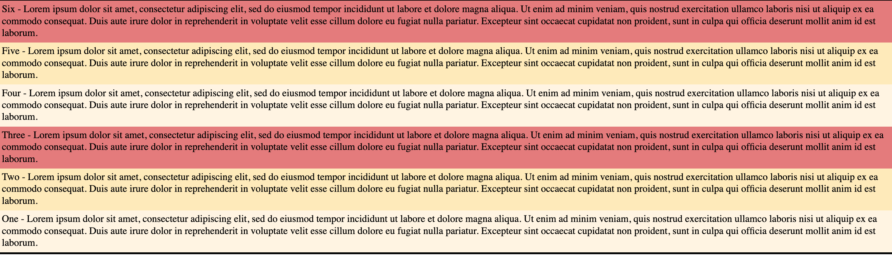

# Flexbox Basics

Flexbox is a one-dimensional layout model ie it deals with layout in one dimension at a time - either as a row or a column

## Set up a container

**index.html**

```html
<html>
<head>
    <title>Learn Flexbox</title>
    <link rel="stylesheet" href="index.css">
</head>
<body>
    <div class="container">
        <div class="item-1">One</div>
        <div class="item-2">Two</div>
        <div class="item-3">Three</div>
    </div>
</body>
</html>
```

**index.css**

```css
body {
    margin: 0;
}
.container {
    border: 3px solid #000;
}

.item-1 {
    background-color: #fff4e1;
    padding: 5px;
}

.item-2 {
    background-color: #ffebb7;
    padding: 5px;
}

.item-3 {
    background-color: #e67a7a;
    padding: 5px;
}
```

<figure><figcaption><p>Container</p></figcaption></figure>


Container and direct children can be any elements like \<ul>\<li> etc and not just div.&#x20;


## The flex container

To create a flex container, set display property to `flex` or `inline-flex`. Direct children turn into flex items

* Items display in a row from left to right by default
* Items will stretch to fill the size of the cross axis
* If there are more items than can fit in the container, they will not wrap but overflow by default

```css
.container {
  display: flex; /* or inline-flex */
}
```

<figure><figcaption><p>display:flex</p></figcaption></figure>

Other properties for the parent:

* flex-direction
* flex-wrap
* flex-flow
* justify-content
* align-items
* align-content
* gap, row-gap, column-gap

### flex-direction

Main axis is defined by `flex-direction` property and cross-axis runs perpendicular to it.&#x20;

```css
.container {
  flex-direction: row | row-reverse | column | column-reverse;
}
```

* _row (default):_ Main axis runs in the row direction and elements are placed left to right as shown above
* _row-reverse:_ Main axis is still in the row direction but start/end lines are switched, so items will be placed right to left
* _column:_ Main axis runs in column direction and elements are placed from top to bottom
* _column-reverse:_ Main axis still runs in column direction but start/end lines are switched, so elements are placed from bottom to top

<figure><figcaption><p>row-reverse</p></figcaption></figure>

<figure><figcaption><p>column</p></figcaption></figure>

<figure><figcaption><p>column-reverse</p></figcaption></figure>

### flex-wrap

By default, flex items will all try to fit into one line.

```css
.container {
  flex-wrap: nowrap | wrap | wrap-reverse;
}
```

* _nowrap (default):_ all flex items on one line
* _wrap:_ flex items will wrap onto multiple lines, top to bottom
* _wrap-reverse:_ flex items will wrap onto multiple lines, bottom to top

<figure><figcaption><p>nowrap</p></figcaption></figure>

<figure><figcaption><p>wrap</p></figcaption></figure>

<figure><figcaption></figcaption></figure>

### flex-flow

### justify-content

Placing items along the main axis of a flex container &#x20;

* flex-start(default)
* flex-end
* center
* space-around: equal space added on left/right of element
* space-between: first and last elements at the ends and space between them
* space-evenly: equal space added between elements and beg/end

### align-items


## The flex items

Properties for the children

* order
* flex-grow
* flex-shrink
* flex-basis
* flex
* align-self
